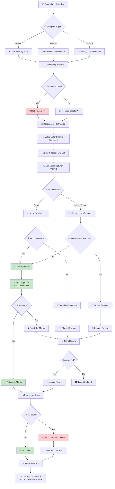

# 🤖 Dependabot Integration with Vulnerability Scanning

This document explains how WebGoat's vulnerability scanning pipeline seamlessly integrates with GitHub Dependabot for automated dependency management and security updates.

## 🎯 Overview

The integration creates a fully automated security pipeline that:
- **Detects** outdated dependencies automatically
- **Scans** dependency updates for security improvements
- **Auto-approves** security updates that reduce vulnerabilities
- **Provides intelligent feedback** on all dependency changes
- **Tracks metrics** for security posture improvements

---

## ⚙️ Configuration Summary

### Dependabot Settings (`/.github/dependabot.yml`)

| Ecosystem | Frequency | Priority | Auto-Approval |
|-----------|-----------|----------|---------------|
| **Maven** | Daily | High (Security) | ✅ Yes |
| **GitHub Actions** | Weekly (Monday) | Medium | ✅ Conditional |
| **Docker** | Weekly (Tuesday) | Medium | ✅ Conditional |

### Key Features:
- 🔒 **Daily Maven scans** for security-critical Java dependencies
- 🏷️ **Smart grouping** of related dependencies (Spring Framework, Security libs)
- 📝 **Semantic commit messages** (`fix(deps): security update`)
- 🚫 **Manual review** for OWASP and critical infrastructure updates

---

## 🔄 Automated Workflow

### **Visual Workflow Diagram**



### 1. **Dependabot Detection**
```yaml
- name: Detect Dependabot PR
  if: github.actor == 'dependabot[bot]'
```
- Automatically identifies Dependabot PRs
- Extracts dependency information from PR titles
- Flags security vs. regular updates

### 2. **Enhanced Security Analysis**
```python
# Dependabot-specific vulnerability analysis
if is_dependabot:
    if 'security' in pr_title.lower() or total_vulns == 0:
        security_improvements = True
```
- Analyzes if the update reduces vulnerabilities
- Provides Dependabot-specific recommendations
- Compares security posture before/after

### 3. **Auto-Approval Logic**
```yaml
- name: Auto-approve Dependabot Security Updates
  if: |
    steps.dependabot-check.outputs.is_dependabot == 'true' && 
    (steps.parse-vulns.outputs.security_improvements == 'true' || 
     steps.parse-vulns.outputs.has_vulnerabilities == 'false')
```

**Auto-approval triggers when:**
- ✅ It's a Dependabot PR
- ✅ Security improvements detected OR no vulnerabilities found
- ✅ PR is marked as a security update

---

## 🎯 Auto-Approval Criteria

### ✅ **Automatically Approved:**
- Security updates with **0 vulnerabilities** after update
- Updates that **reduce total vulnerability count**
- Security-labeled updates with **CVSS < 7.0** remaining issues

### ⚠️ **Requires Review:**
- Updates that **introduce new high-severity vulnerabilities**
- Non-security updates with **existing vulnerabilities**
- Updates to **critical infrastructure dependencies** (OWASP, etc.)

### 🚨 **Blocked/Manual Review:**
- Updates that **increase vulnerability count**
- Updates with **new Critical (CVSS 9.0+) vulnerabilities**
- Dependencies in the **manual review ignore list**

---

## 💬 Enhanced PR Comments

### For Dependabot PRs:
```markdown
## 🤖 Dependabot Security Analysis

✅ **This dependency update addresses security issues!**

**Total Vulnerabilities Found:** 2
- 🔴 Critical: 0
- 🟠 High: 0  
- 🟡 Medium: 2

### Dependabot Recommendations
✅ **Recommended Action:** Approve and merge this security update
1. This update addresses known security vulnerabilities
2. Review the changes and test thoroughly
3. Consider prioritizing this merge for security benefits
```

### Auto-Approval Message:
```markdown
✅ **Auto-approved by Security Pipeline**

This Dependabot PR has been automatically approved because:
- It's a security update that reduces vulnerabilities
- No high-severity issues were introduced
- Automated security scan passed

🔒 **Security Status:** Improved
📊 **Vulnerabilities:** 0
⏰ **Scan Date:** 2025-01-XX
```

---

## 🏷️ Automatic Labeling

### Dependabot PRs get labeled with:
- `dependencies` - All dependency updates
- `maven`/`github-actions`/`docker` - Ecosystem-specific
- `security-improvement` - When vulnerabilities are reduced
- `dependabot-approved` - When auto-approved by pipeline

### Security issues get:
- `security` - All security-related issues
- `vulnerability-scan` - Generated by pipeline
- `needs-triage` - Requires team attention
- `critical`/`high-priority` - Based on severity

---

## 📊 Metrics & Monitoring

The integration tracks:

### **Security Metrics:**
- 📈 **Vulnerability reduction rate** from Dependabot updates
- ⏱️ **Mean Time to Resolution (MTTR)** for security issues
- 🎯 **Auto-approval success rate** (no regressions)
- 📋 **Dependency freshness** across all ecosystems

### **Operational Metrics:**
- 🤖 **Dependabot PR volume** (daily/weekly/monthly)
- 👥 **Manual review rate** vs auto-approval
- 🔄 **Merge velocity** for security updates
- 📊 **False positive rate** in auto-approvals

---

## 🛡️ Security Best Practices

### **Implemented Safeguards:**
1. **🎯 Targeted Auto-Approval** - Only security improvements
2. **📊 Continuous Monitoring** - Post-merge vulnerability scans
3. **🚫 Manual Review Gates** - Critical dependencies excluded
4. **📝 Audit Trail** - All decisions logged and tracked
5. **🔄 Rollback Capability** - Easy to revert problematic updates

### **Team Responsibilities:**
- **Security Team**: Monitor auto-approvals, handle critical issues
- **Development Team**: Review non-security updates, test changes
- **DevOps Team**: Monitor pipeline health, update configurations

---

## 🚀 Benefits Achieved

### **For Security:**
- 🔒 **Faster security patch deployment** (hours vs. days)
- 📊 **Reduced vulnerability window** through automation
- 🎯 **Consistent security posture** monitoring
- 📈 **Improved compliance** with security standards

### **For Development:**
- ⚡ **Reduced manual review overhead** for routine updates
- 🎯 **Focus on high-impact changes** requiring human judgment
- 📋 **Clear security guidance** for all dependency changes
- 🔄 **Streamlined development workflow**

### **For Operations:**
- 📊 **Comprehensive security metrics** and reporting
- 🤖 **Predictable automation** with human oversight
- 🛡️ **Risk-based prioritization** of updates
- 📈 **Continuous improvement** through data analysis

---

## 🔧 Configuration Examples

### Enable Auto-Merge (Optional)
```yaml
# In repository settings or via CLI
gh api repos/:owner/:repo --method PATCH \
  --field allow_auto_merge=true
```

### Custom CVSS Thresholds
```yaml
env:
  DEPENDABOT_AUTO_MERGE_THRESHOLD: 7.0  # Current setting
  CVSS_THRESHOLD: 4.0                   # Minimum for reporting
```

### Add Custom Dependency Groups
```yaml
# In .github/dependabot.yml
groups:
  security-critical:
    patterns:
      - "org.springframework.security*"
      - "*crypto*"
      - "*auth*"
```

---

## 📞 Support & Troubleshooting

### **Common Issues:**
1. **Auto-approval not working** → Check Dependabot actor detection
2. **Too many false positives** → Adjust CVSS thresholds
3. **Missing security updates** → Verify Dependabot schedule
4. **Slow vulnerability scans** → Check NVD API key configuration

### **Getting Help:**
- 📊 Check the **Security Dashboard** for metrics
- 🔍 Review **GitHub Actions logs** for detailed output
- 🎫 Create **GitHub Issues** with `vulnerability-scan` label
- 📧 Contact **Security Team** for policy questions

---

*This integration represents a best-practice approach to automated dependency security management, balancing automation with human oversight for optimal security outcomes.* 