# GitHub Dependabot Security Pipeline Design

Based on your WebGoat Java project structure and existing Dependabot configuration, here's a comprehensive no-code pipeline design:

## Architecture Overview

### Pipeline Components
1. **GitHub Actions Workflows** (2 separate workflows)
2. **GitHub Advanced Security Integration** (Code Scanning & Dependabot Alerts)
3. **GitHub Issues API** (for issue creation/management)
4. **Notification System** (PR comments & alerts)
5. **State Management** (tracking and auto-closure logic)

---

## Part 1: Feature Branch Security Scanning

### Trigger Configuration
- **Event**: `pull_request` (opened, synchronize, reopened)
- **Branches**: All feature branches (exclude `main`)
- **Path Filters**: Include dependency files (`pom.xml`, `Dockerfile`, `.github/workflows/*`)

### Workflow Logic Flow
```
1. Checkout feature branch
2. Enable Dependabot vulnerability scanning
3. Wait for scan completion (with timeout)
4. Fetch vulnerability results via GitHub API
5. Filter findings (Medium+ severity only)
6. Generate consolidated vulnerability report
7. Post PR comment with findings
8. Create/update security alerts in GitHub
9. Set PR status check (fail if Medium+ vulnerabilities found)
```

### Severity Filtering Criteria
- **High/Critical**: Block PR until resolved
- **Medium**: Warning with detailed explanation
- **Low**: Informational only (no alerts)

### Comment Template Structure
```
🚨 **Security Vulnerability Scan Results**

**Summary**: Found X vulnerabilities (Y High, Z Medium)

**High Severity Issues:**
- [Package Name] v[version] - [CVE ID]
  - **Impact**: [Description]
  - **CVSS Score**: [score]
  - **Recommendation**: [Upgrade to version X or apply patch]

**Medium Severity Issues:**
- [Similar format as above]

**Remediation Steps:**
1. Update dependencies using: `mvn versions:use-latest-versions`
2. Review and test changes
3. Re-run security scan

---
📞 **Need Help?** Contact your Application Security Team at [security@company.com] for assistance with vulnerability remediation.
```

---

## Part 2: Main Branch Integration (Post-Merge)

### Trigger Configuration
- **Event**: `push` to `main` branch
- **Additional**: `workflow_dispatch` for manual scans

### Enhanced Workflow Logic
```
1. All steps from Part 1
2. Create GitHub Issues for new vulnerabilities
3. Link issues to specific CVEs and packages
4. Set up issue tracking labels and assignees
5. Schedule follow-up scans for auto-closure
6. Update security dashboard/metrics
```

### GitHub Issue Management

#### Issue Creation Logic
- **One issue per unique vulnerability** (grouped by CVE)
- **Issue Title**: `[SECURITY] CVE-XXXX-XXXX in [package-name]`
- **Labels**: `security`, `vulnerability`, severity level (`high`, `medium`)
- **Assignee**: Security team or designated maintainer
- **Project**: Add to Security Dashboard project

#### Issue Template
```markdown
## Security Vulnerability Alert

**CVE ID**: CVE-XXXX-XXXX
**Package**: [package-name] v[version]
**Severity**: [High/Medium]
**CVSS Score**: [score]

### Vulnerability Details
[Description from security advisory]

### Affected Components
- [ ] Production dependencies
- [ ] Development dependencies
- [ ] Docker base images

### Remediation Plan
- [ ] Update to version [X.X.X] or later
- [ ] Test application functionality
- [ ] Deploy security patch
- [ ] Verify fix with rescan

### Timeline
- **Discovered**: [Date]
- **Target Resolution**: [Date based on severity]

---
**Auto-generated by Security Pipeline** | Contact App Security Team for assistance
```

---

## Auto-Closure Mechanism Design

### Rescan Triggers
- **Scheduled**: Daily scans on `main` branch
- **Event-driven**: After dependency updates (Dependabot PRs merged)
- **Manual**: `workflow_dispatch` trigger

### Auto-Closure Logic
```
1. Run fresh vulnerability scan
2. Compare current findings with tracked issues/alerts
3. For each resolved vulnerability:
   - Close corresponding GitHub issue
   - Add closure comment with resolution details
   - Remove security alerts
   - Update metrics dashboard
4. Archive resolved issues with proper labeling
```

### State Tracking Mechanism
- **GitHub Issues**: Primary tracking via issue numbers and CVE labels
- **Workflow Artifacts**: Store scan results for comparison
- **Repository Variables**: Track scan metadata and metrics

---

## Integration Points & Configuration

### Required GitHub Settings
1. **Enable GitHub Advanced Security**
2. **Configure Dependabot Alerts** (already partially configured)
3. **Set up Code Scanning API access**
4. **Create repository secrets for notifications**

### Repository Permissions
- `contents: read` - Access repository code
- `issues: write` - Create/update/close issues
- `pull-requests: write` - Add comments and status checks
- `security-events: write` - Manage security alerts
- `actions: read` - Access workflow metadata

### Notification Configuration
- **Slack Integration**: Optional webhook for critical findings
- **Email Alerts**: For security team on High/Critical issues
- **Teams Integration**: Status updates and metrics

---

## Workflow Files Structure

### Required Workflow Files
1. `feature-branch-security-scan.yml` - Part 1 implementation
2. `main-branch-security-pipeline.yml` - Part 2 implementation  
3. `security-rescan-scheduler.yml` - Automated rescanning for closure
4. `security-metrics-dashboard.yml` - Optional reporting workflow

### Dependency Updates
Enhance existing `dependabot.yml` with:
- **Security-only updates**: Separate configuration for security patches
- **Auto-merge rules**: For low-risk security updates
- **Priority scheduling**: More frequent scans for security updates

---

## Success Metrics & Monitoring

### Key Performance Indicators
- **Mean Time to Detection** (MTTD): How quickly vulnerabilities are identified
- **Mean Time to Resolution** (MTTR): Time from detection to fix
- **Vulnerability Backlog**: Count of open security issues
- **Auto-closure Rate**: Percentage of issues resolved automatically

### Dashboard Integration
- **GitHub Projects**: Security vulnerability tracking board
- **GitHub Insights**: Security alert trends and metrics
- **Custom Reporting**: Weekly security status reports

This design provides a comprehensive, automated security pipeline that leverages GitHub's native capabilities while maintaining flexibility for your WebGoat project's specific needs.

---

## Workflow Design Diagrams

### High-Level Pipeline Flow

```mermaid
flowchart TD
    A[Pull Request Created/Updated] --> B{Branch Type?}
    B -->|Feature Branch| C[Part 1: Feature Branch Scan]
    B -->|Main Branch| D[Part 2: Main Branch Integration]
    
    subgraph "Part 1: Feature Branch Security Scanning"
        C --> E[Checkout Feature Branch]
        E --> F[Enable Dependabot Scanning]
        F --> G[Wait for Scan Completion]
        G --> H[Fetch Vulnerability Results]
        H --> I{Medium+ Vulnerabilities<br/>Found?}
        I -->|No| J[✅ Set PR Status: Pass]
        I -->|Yes| K[Filter High/Medium Severity]
        K --> L[Generate Vulnerability Report]
        L --> M[Post PR Comment with Details]
        M --> N[Create Security Alerts]
        N --> O[❌ Set PR Status: Fail]
        O --> P[Add Contact Info:<br/>Application Security Team]
    end
    
    subgraph "Part 2: Main Branch Integration"
        D --> Q[All Part 1 Steps]
        Q --> R{New Vulnerabilities<br/>Detected?}
        R -->|No| S[Update Security Dashboard]
        R -->|Yes| T[Create GitHub Issues]
        T --> U[Set Issue Labels & Assignees]
        U --> V[Link to CVE Database]
        V --> W[Add to Security Project]
        W --> S
    end
    
    subgraph "Auto-Closure Mechanism"
        X[Scheduled Daily Scan] --> Y[Fresh Vulnerability Scan]
        Z[Dependabot PR Merged] --> Y
        AA[Manual Trigger] --> Y
        Y --> BB[Compare with Tracked Issues]
        BB --> CC{Vulnerabilities<br/>Resolved?}
        CC -->|Yes| DD[Close GitHub Issues]
        CC -->|No| EE[Keep Issues Open]
        DD --> FF[Add Closure Comments]
        FF --> GG[Remove Security Alerts]
        GG --> HH[Update Metrics Dashboard]
    end
    
    subgraph "Severity Actions"
        II[High/Critical] --> JJ[❌ Block PR Merge]
        KK[Medium] --> LL[⚠️ Warning + Details]
        MM[Low] --> NN[ℹ️ Informational Only]
    end
    
    J --> OO[PR Can Be Merged]
    P --> PP[Developer Reviews & Fixes]
    PP --> QQ[Re-run Security Scan]
    
    S --> RR[Security Dashboard Updated]
    HH --> RR
    
    style C fill:#e1f5fe
    style D fill:#f3e5f5
    style X fill:#e8f5e8
    style II fill:#ffebee
    style KK fill:#fff3e0
    style MM fill:#e8f5e8
```



### Detailed System Architecture

```mermaid
graph TB
    subgraph "GitHub Repository Events"
        A[PR Created/Updated<br/>Feature Branch] 
        B[Push to Main Branch]
        C[Dependabot PR Merged]
        D[Scheduled Daily Scan]
        E[Manual Workflow Trigger]
    end
    
    subgraph "Part 1: Feature Branch Security Pipeline"
        A --> F1[🔍 Initialize Security Scan]
        F1 --> F2[📥 Checkout Feature Branch]
        F2 --> F3[🤖 Enable Dependabot Analysis]
        F3 --> F4[⏱️ Wait for Scan Results]
        F4 --> F5{🎯 Filter Results<br/>Medium+ Severity?}
        
        F5 -->|No Vulnerabilities| F6[✅ PR Status: PASS<br/>No Action Required]
        F5 -->|Vulnerabilities Found| F7[📊 Generate Report]
        
        F7 --> F8[💬 Post PR Comment]
        F8 --> F9[🚨 Create Security Alerts]
        F9 --> F10[❌ PR Status: FAIL]
        F10 --> F11[📞 Add Security Team Contact]
        
        F6 --> F12[🚀 Ready for Merge]
        F11 --> F13[🔧 Developer Remediation]
        F13 --> F14[🔄 Trigger Rescan]
        F14 --> F1
    end
    
    subgraph "Part 2: Main Branch Security Pipeline"
        B --> M1[🔍 Execute Part 1 Scan Logic]
        M1 --> M2{🆕 New Vulnerabilities<br/>vs Previous Scan?}
        
        M2 -->|No New Issues| M3[📈 Update Dashboard Only]
        M2 -->|New Issues Found| M4[🎫 Create GitHub Issues]
        
        M4 --> M5[🏷️ Apply Labels & Assign]
        M5 --> M6[🔗 Link to CVE Database]
        M6 --> M7[📋 Add to Security Project]
        M7 --> M8[📧 Notify Security Team]
        M8 --> M3
    end
    
    subgraph "Auto-Closure & Monitoring System"
        C --> AC1[🔄 Trigger Rescan]
        D --> AC1
        E --> AC1
        
        AC1 --> AC2[🔍 Fresh Vulnerability Scan]
        AC2 --> AC3[📊 Compare with Tracked Issues]
        AC3 --> AC4{✅ Issues Resolved?}
        
        AC4 -->|Resolved| AC5[🔒 Close GitHub Issues]
        AC4 -->|Still Present| AC6[⏳ Keep Issues Open]
        
        AC5 --> AC7[💬 Add Resolution Comments]
        AC7 --> AC8[🚨 Remove Security Alerts]
        AC8 --> AC9[📈 Update Metrics]
        
        AC6 --> AC10[📅 Update Timeline]
        AC10 --> AC11[🔔 Escalate if Overdue]
    end
    
    subgraph "Severity-Based Actions"
        S1[🔴 HIGH/CRITICAL<br/>Block Merge] 
        S2[🟡 MEDIUM<br/>Warning + Details]
        S3[🟢 LOW<br/>Information Only]
    end
    
    subgraph "Output & Notifications"
        O1[📝 PR Comments with<br/>Vulnerability Details]
        O2[🎫 GitHub Issues<br/>for Tracking]
        O3[🚨 Security Alerts<br/>in Repository]
        O4[📊 Security Dashboard<br/>& Metrics]
        O5[📞 Application Security<br/>Team Contact]
    end
    
    F7 --> S1
    F7 --> S2
    F7 --> S3
    
    F8 --> O1
    M4 --> O2
    F9 --> O3
    M3 --> O4
    F11 --> O5
    
    style A fill:#e3f2fd
    style B fill:#f3e5f5
    style F1 fill:#e8f5e8
    style M1 fill:#fff3e0
    style AC1 fill:#fce4ec
    style S1 fill:#ffebee
    style S2 fill:#fff8e1
    style S3 fill:#e8f5e8
``` 

