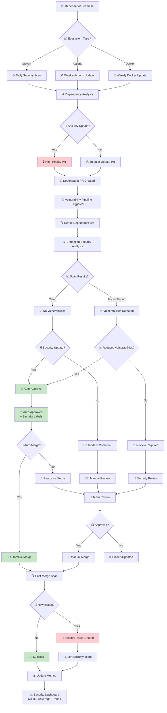
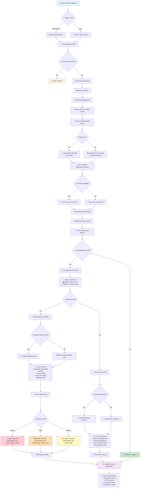
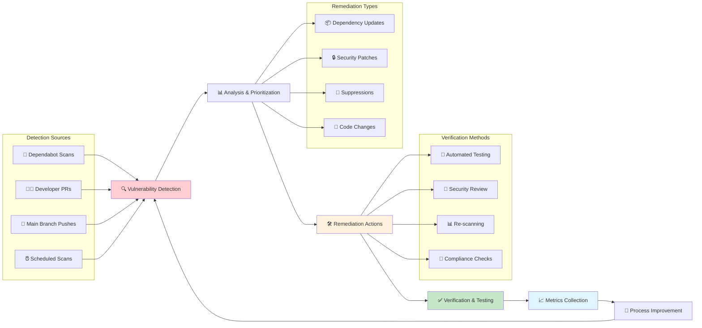

# 📊 Security Pipeline Workflow Diagrams

This document contains visual diagrams of all security workflows in the WebGoat project for easy reference and understanding.

---

## 🤖 Dependabot Integration Workflow

### **Complete Dependabot Security Pipeline**

**Key Decision Points:**
- 🔒 **Security Update Detection**: Based on PR title and dependency analysis
- 🚀 **Auto-Approval Logic**: Reduces vulnerabilities + no new high-severity issues
- 🎯 **Auto-Merge**: Optional feature for fully automated security updates
- 📊 **Continuous Monitoring**: Post-merge scans ensure no regressions

---

## 🔍 Vulnerability Scanning Workflow

### **Complete Vulnerability Detection & Response Pipeline**

**Key Features:**
- 🎯 **Smart Triggering**: Ignores documentation-only changes
- 💾 **Performance Optimization**: NVD database caching for speed
- 🔑 **API Integration**: NVD API key for faster vulnerability data
- 📊 **Rich Analytics**: Python-based result parsing and categorization
- 💬 **Intelligent Feedback**: Different responses for PRs vs main branch
- 🏷️ **Automatic Labeling**: Severity-based issue classification

---

## 🔄 Security Feedback Loop

### **Continuous Security Improvement Cycle**

---

## 📊 Metrics & Reporting Dashboard

### **Security Posture Tracking**

```mermaid
graph TD
    A[📊 Security Metrics Dashboard] --> B[📈 Vulnerability Trends]
    A --> C[⏱️ Response Metrics]
    A --> D[🎯 Automation Metrics]
    A --> E[📋 Compliance Metrics]
    
    B --> B1[🔴 Critical Vulnerabilities Over Time]
    B --> B2[🟠 High Severity Trends]
    B --> B3[📉 Total Vulnerability Reduction]
    B --> B4[🆕 New vs Resolved Issues]
    
    C --> C1[⏱️ Mean Time to Detection MTTD]
    C --> C2[🔧 Mean Time to Resolution MTTR]
    C --> C3[📅 SLA Compliance Rates]
    C --> C4[🚨 Emergency Response Times]
    
    D --> D1[🤖 Auto-Approval Success Rate]
    D --> D2[📦 Dependabot PR Volume]
    D --> D3[✅ Scan Success Rate]
    D --> D4[💾 Cache Hit Rates]
    
    E --> E1[📊 Coverage Percentage]
    E --> E2[🛡️ Security Policy Compliance]
    E --> E3[📝 Audit Trail Completeness]
    E --> E4[🎯 Regulatory Alignment]
    
    style A fill:#e8f5e8
    style B fill:#fff3e0
    style C fill:#e1f5fe
    style D fill:#f3e5f5
    style E fill:#fce4ec
```

---

## 📚 Documentation References

### **Related Documentation Files:**
- 📖 [`DEPENDABOT_INTEGRATION.md`](./DEPENDABOT_INTEGRATION.md) - Complete Dependabot integration guide
- 📖 [`VULNERABILITY_SCAN_README.md`](./VULNERABILITY_SCAN_README.md) - Vulnerability scanning pipeline documentation
- ⚙️ [`vulnerability-scan.yml`](./vulnerability-scan.yml) - GitHub Actions workflow configuration
- ⚙️ [`dependabot.yml`](../dependabot.yml) - Dependabot configuration

### **Key Configuration Files:**
- 🔧 [`project-suppression.xml`](../../config/dependency-check/project-suppression.xml) - Vulnerability suppressions
- 📝 [`pom.xml`](../../pom.xml) - Maven dependency and plugin configuration

---

## 🎯 Quick Reference

### **Workflow Statuses:**
- 🟢 **Green**: No vulnerabilities detected, all systems secure
- 🟡 **Yellow**: Medium severity vulnerabilities, review recommended
- 🟠 **Orange**: High severity vulnerabilities, action required within 24-48h
- 🔴 **Red**: Critical vulnerabilities, immediate action required

### **Auto-Approval Conditions:**
- ✅ Dependabot PR + Security improvements
- ✅ Clean vulnerability scan (0 issues)
- ✅ Reduces existing vulnerability count
- ✅ No new Critical/High severity issues

### **Manual Review Required:**
- ⚠️ New high-severity vulnerabilities introduced
- ⚠️ Updates to critical infrastructure dependencies
- ⚠️ Non-security updates with existing vulnerabilities
- ⚠️ Dependencies in manual review ignore list

---

*These diagrams provide a visual representation of the automated security pipeline, helping team members understand the flow and decision points in our vulnerability management process.* 