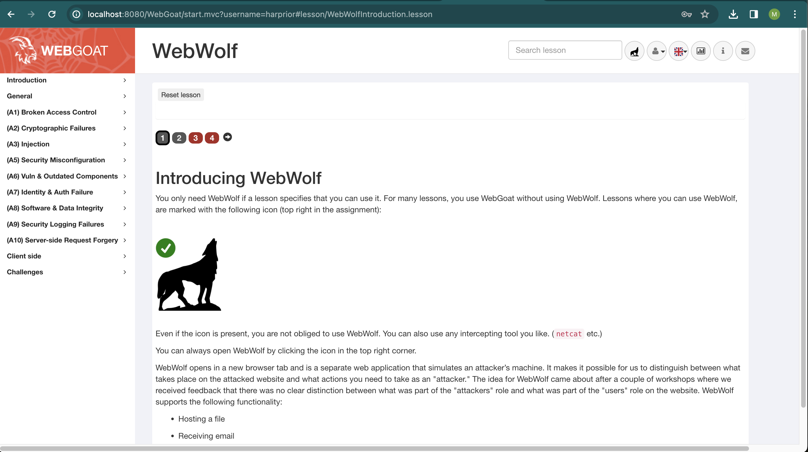

## Steps I followed to run the application

1. Clone WebGoat repository to my local machine with git clone git@github.com:harprior/WebGoat.git command

2. Install Docker

3. Pull Webgoat docket image with pull webgoat/webgoat

3. Run docker run -p 127.0.0.1:8080:8080 -p 127.0.0.1:9090:9090 -e TZ=Europe/Amsterdam webgoat/webgoat to install it

4. Realize that my time zone is not TZ=Europe/Amsterdam and re-start container with correct TZ=Asia/Jerusalem timezone ... 

5. Check that application is running with ~ docker ps

6. Follow to http://8080/WebGoat

7. 

8. When to Webgoat repository Settings on Github - Branches - Toggled Require a pull request before merging - - Name Branch name pattern as 'main' - Create rule

9. 